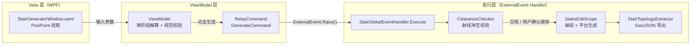

# 🪜 StairsPlugin

**面向 CIM 室内网络的双跑楼梯参数化自动生成引擎**
*A Revit API plugin for code-compliant, ray-cast-verified parametric staircase generation*


一个基于 Autodesk Revit API 二次开发的插件：在平面图上拾取两个点、填几个几何参数，即可自动生成符合国家规范（GB55031-2022 / GB55038-2025 / GB55037-2022）的双跑平行楼梯。生成事务开始**之前**，插件会用射线投射沿竖直方向完成净空高度前置校验，而不是等模型建完后再用传统碰撞检测去斜向扫一遍。生成完成后自动导出室内拓扑 GeoJSON，可直接拖进 kepler.gl 验证楼梯与疏散路径的连通精度。

**TL;DR (EN):** A Revit plugin that parametrically generates double-flight staircases, validates minimum headroom via vertical ray-casting *before* the geometry transaction starts (instead of after-the-fact mesh collision, which measures along the wrong axis), and exports the resulting indoor topology as GeoJSON for BIM↔GIS integration.

本项目脱胎于我的本科毕业设计（地理信息科学专业），关注的是 BIM 几何生产与 3D GIS / CIM 室内网络拓扑之间的连通性问题。


<!-- 建议替换为：插件交互界面 + Revit 生成效果的拼图 -->

## ✨ 核心特性

- **🧩 规范驱动的规则库**：GB55031-2022 / GB55038-2025 / GB55037-2022 三本国标以字典形式固化为规则库（[`StairCodeLibrary.cs`](./StairCodeLibrary.cs)），覆盖住宅 / 一般公共建筑 / 附属楼梯（多层高层）/ 附属楼梯（超高层）四类建筑功能类型，切换类型即切换全部阈值，新增类型只需加一条字典项。
- **📐 两阶段踏步解算**：不要求用户手动输入踏步级数——由 P1→P2 的平面距离和平台深度反算总级数（阶段一），再由底部/顶部标高的竖向净高差反推每级踢面高（阶段二），保证界面预览与生成几何永远一致。
- **📡 射线投射净空前置校验**：在 `StairsEditScope` 打开之前，沿每一级踏步面代表点的 +Z 方向发射虚拟射线（`ReferenceIntersector`），命中楼板/梁/屋顶底面即得到毫米级净高数值。相比传统碰撞检测常见的"沿坡面法线"方向，避免了因坡度导致的净高误判（典型住宅楼梯坡度下偏差可达约 20%）。不合规时前置弹窗拦截，不产生任何模型修改。
- **🔗 坐标变换单一来源**：楼梯生成（`StairGlobalEventHandler`）与净空校验（`ClearanceChecker`）共享同一个 [`CoordinateTransform`](./CoordinateTransform.cs) 静态类构建的旋转平移矩阵，杜绝"两处各写一遍矩阵乘法"导致射线起点与实际梯段错位的隐患。
- **🧵 MVVM + ExternalEvent 全异步架构**：非模态窗口 + `ExternalEvent.Raise()`，彻底解耦 WPF 消息循环与 Revit 事务上下文，`Selection.PickPoint` 与插件窗口互不阻塞。
- **🗺️ 室内拓扑 GeoJSON 导出**：生成完成后自动提取房间节点、疏散路径、楼梯跨层连接线，可直接拖入 kepler.gl 做三维可视化验证，为 BIM 数据接入 CIM 平台提供室内网络拓扑基础。

## 🏗 系统架构



三层职责边界很硬：View 只留 `PickPoint` 和关窗两件离不开 Revit UI 线程的事；所有校验和解算逻辑在 ViewModel；真正调用 Revit API 写模型的动作全部收在 Handler 里，且只在 `ExternalEvent` 回调的合法上下文中执行。

## 🧠 关键算法

### 两阶段踏步解算

设 P1P2 水平距离为 `d`，踏步宽为 `b`，平台深度为 `L`，竖向净高差为 `H`：

```
阶段一（平面反算级数）:
raw = (d - L) × 2 / b
n   = ceil(raw)          # 向上取整
若 n 为奇数 → n = n - 1   # 强制为偶数，保证两跑对称

阶段二（竖向反算踢面高）:
h = H / (n + 2)           # +2 为 Revit 首尾补偿踢面
```

对应实现：[`StairCalculator.cs`](./StairCalculator.cs)、`ViewModel.Recalculate()`（见 [`ViewModel.cs`](./ViewModel.cs)）。平面尺寸由 P1P2 真实距离决定，竖向尺寸由真实层高决定，界面预览和最终生成几何用的是同一套数字。

### 净空校验：射线法 vs 传统碰撞检测

| 维度 | 传统碰撞检测 | 本插件射线法 |
| --- | --- | --- |
| 能否输出净高数值 | ❌ 仅"有/无干涉"布尔值 | ✅ 精确到毫米 |
| 检测时机 | 模型建完后（事后） | `StairsEditScope` 打开前（事前） |
| 量取方向 | 沿坡面法线（斜向） | 沿 +Z 竖直方向 |
| 典型偏差 | 住宅楼梯坡度下约偏大 20% | 与 GB55031-2022 §5.3.9 要求一致 |
| 对已有模型的依赖 | 需要已生成的三维实体 | 仅需参数内存推算 |

对应实现：[`ClearanceChecker.cs`](./ClearanceChecker.cs)（射线检测核心为 `CastRayUp`，起点坐标计算复用 `CoordinateTransform`）。


## 📁 项目结构

```
StairsPlugin/
├── Main.cs                      # IExternalCommand 入口：创建 ExternalEvent/Handler，注入项目数据，弹出非模态窗口
├── ViewModel.cs                 # 核心 ViewModel：两阶段解算、规范校验、Badge 状态、GenerateCommand
├── ViewModelBase.cs             # INotifyPropertyChanged 基类（OnPropertyChanged / SetField<T>）
├── RelayCommand.cs              # 通用 ICommand 实现，绑定 WPF Button.Command
├── ViolationCollector.cs        # 违规消息聚合值对象，统一 HasViolation / ViolationDetail 格式
├── StairGeneratorWindow.xaml    # 主窗口界面：5 大分区、15 个交互控件
├── StairGeneratorWindow.xaml.cs # View 层 code-behind：仅保留 PickPoint 与关闭窗口两类必要逻辑
├── Stairglobalevent.cs          # ExternalEventHandler：读取标高→净空预检→StairsEditScope 生成→栏杆处理→GeoJSON 导出
├── CoordinateTransform.cs       # 局部坐标系↔世界坐标系变换（生成与校验共享同一实现）
├── ClearanceChecker.cs          # 射线投射净空校验（ReferenceIntersector）
├── StairCalculator.cs           # 两阶段踏步解算核心算法
├── StairCodeParams.cs           # 规范参数值对象 + BuildingType 枚举
├── StairCodeLibrary.cs          # 四类建筑功能类型对应的规范规则字典
├── RevitLevelTools.cs           # 标高读取 / 格式化 / 净高差计算工具
├── UnitConverter.cs             # 毫米 ↔ 英尺（Revit 内部单位）统一换算
└── StairTopologyExtractor.cs    # 室内拓扑提取：房间 / 疏散路径 / 楼梯跨层连接 → GeoJSON
```

## ⚙️ 技术栈

| 分类 | 技术 |
| --- | --- |
| 平台 | Autodesk Revit 2022（Revit API） |
| 语言 / 框架 | C#, .NET Framework 4.8 |
| UI | WPF, XAML, MVVM |
| 核心 Revit API | `StairsEditScope`, `StairsRun`, `StairsLanding`, `ReferenceIntersector`, `ExternalEvent`, `Transform` |
| 数据导出 | GeoJSON |
| 三维验证 | [kepler.gl](https://kepler.gl/) |
| 开发环境 | Visual Studio 2022 |

## 🚀 快速开始

### 环境要求

- Windows 10 / 11
- Autodesk Revit **2022**（需要本机安装的 `RevitAPI.dll` / `RevitAPIUI.dll`；Autodesk 不允许再分发这两个 DLL，仓库不包含它们，需要在项目引用中指向你本机的 Revit 安装目录）
- Visual Studio 2022
- .NET Framework 4.8

### 编译与部署

1. 克隆本仓库，在 Visual Studio 中打开解决方案；
2. 检查 `RevitAPI.dll` / `RevitAPIUI.dll` 的引用路径，一般位于：
```
   C:\Program Files\Autodesk\Revit 2022\RevitAPI.dll
   C:\Program Files\Autodesk\Revit 2022\RevitAPIUI.dll
```
   两者的**"复制本地"（Copy Local）需设为 `False`**，避免打包时携带非授权 DLL；
3. 编译生成 `StairsPlugin.dll`；
4. 在 `%APPDATA%\Autodesk\Revit\Addins\2022\` 目录下放置一个 `.addin` 清单文件（若仓库未附带，可参考下方模板自行创建）：

```xml
   <?xml version="1.0" encoding="utf-8" standalone="no"?>
   <RevitAddIns>
     <AddIn Type="Command">
       <Name>双跑楼梯自动生成</Name>
       <Assembly>C:\Path\To\StairsPlugin.dll</Assembly>
       <AddInId>在此填入你自己生成的 GUID</AddInId>
       <FullClassName>StairsPlugin.CommandStairGenerator</FullClassName>
       <VendorId>YOUR_VENDOR_ID</VendorId>
       <VendorDescription>Biao Liu</VendorDescription>
     </AddIn>
   </RevitAddIns>
```

5. 启动 Revit → 打开任意含标高的项目 → 在"外部工具"面板中找到插件按钮并点击。

### 使用流程

1. 空间定位：选择底部/顶部标高，设置底部偏移；
2. 平面定位：在平面视图中依次拾取 P1（插入点）、P2（方向点）；
3. 选择建筑功能类型（自动切换规范阈值）与楼梯族类型；
4. 填写梯段净宽、踏步宽、梯井宽、平台深度（界面实时给出合规 Badge）；
5. 按需勾选"生成扶手"与"净空校验"；
6. 点击"生成楼梯"，等待 ExternalEvent 回调完成建模与 GeoJSON 导出。

## 📊 性能测试

单部楼梯（28 级，层高 3600 mm）完整生成流水线断点计时：

| 阶段 | 耗时 | 占比 |
| --- | --- | --- |
| 规范校验 + 踏步解算 | < 1 ms | < 1% |
| 净空预检（29 个采样点） | ≈ 199 ms | 31% |
| StairsEditScope 几何生成事务 | ≈ 378 ms | 59% |
| 室内拓扑提取 + GeoJSON 导出 | ≈ 7 ms | 1% |
| 其余辅助事务 | ≈ 57 ms | 9% |
| **全流程合计** | **≈ 642 ms** | 100% |

对照人工在 Revit 中手动绘制单部双跑楼梯并核对净空（约 2–3 分钟），效率提升明显；主要耗时集中在 Revit 内核提交几何的固有开销，插件自身逻辑（解算 + 校验 + 导出）占比不到三分之一。


## 🚧 已知局限 & Roadmap

- [ ] 目前仅支持双跑平行楼梯，暂不支持剪刀梯 / 弧形梯 / 三跑折跑楼梯
- [ ] 净空射线采样点集中于踏步宽度方向中心线，对单侧悬梁等宽度方向不均匀遮挡场景覆盖有限（计划引入宽度方向多点采样）
- [ ] 尚未接入 `ProjectBasePoint` / `SurveyPoint` 真实地理坐标配准，室内拓扑目前仍基于 Revit 项目坐标系
- [ ] 未来考虑迁移部分逻辑到 IFC 标准接口，摆脱对单一 BIM 软件的绑定

## 📚 相关文档

- 技术复盘博客：[809570.xyz](https://809570.xyz)（Hexo + Fluid，持续更新中）
- 完整方法说明与测试数据：本科毕业设计《面向城市信息模型数字底座的楼梯参数化自动生成方法》

## 📄 License

本仓库源码以 [MIT License](./LICENSE) 开源。

⚠️ **重要声明**：`RevitAPI.dll` 与 `RevitAPIUI.dll` 为 Autodesk 专有组件，仅供已安装 Revit 的开发者在本机引用，**不包含在本仓库中，也不可再分发**。使用本项目前需自行准备合法的 Revit 安装环境。
